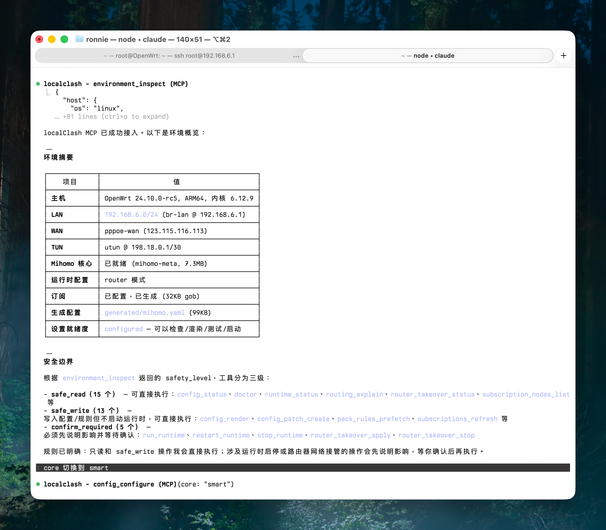

# localClash

Local Mihomo runtime wrapper with an MCP management interface for AI-assisted
Clash, Mihomo, and router workflows.



The screenshot shows an AI agent using localClash MCP to inspect an OpenWrt
router, summarize runtime readiness, and separate safe reads, safe writes, and
confirmation-required operations before making changes.

## Direction

localClash is intended to run near the proxy runtime, such as on a local
machine, NAS, home server, or router. It is not only a remote management helper:
it also owns the local runtime lifecycle for Mihomo. MCP is the management
surface that lets AI agents observe, bootstrap, plan, and confirm operations
against that runtime.

The project is not an admin Web UI. Conversation with an AI agent is the main
management surface. zashboard can still be downloaded and served by Mihomo as a
runtime dashboard, but it is not localClash's configuration UI.

localClash should expose:

- A runtime entrypoint that can ensure prerequisites, render config, validate
  health, and start Mihomo.
- An MCP server as the primary agent management interface.
- CLI commands for bootstrap, debugging, and fallback operation.
- Deterministic renderers for rules, packs, proxy groups, and runtime
  Mihomo configs.
- Read-only diagnostics and runtime inspection for safe agent observation.
- Router adapters for OpenWrt workflows, with write operations gated by
  explicit user confirmation.

New users should start with [First Use](docs/first-use.md) for the shortest
path from a fresh checkout to a running local Mihomo runtime.

## Release And LuCI Boundary

The related OpenWrt LuCI project lives at
[qoli/localclash-luci](https://github.com/qoli/localclash-luci). localClash core
releases publish Linux binaries, base assets, checksums, and a
`localclash-release-manifest.json` file. The LuCI package consumes that manifest
from the latest core release when the user installs or updates the core from the
router UI.

The LuCI package is a separate UI/integration channel. A new core release does
not require a LuCI package release unless the LuCI frontend, rpcd helper, ACL,
menu metadata, or package files changed. Users with a current LuCI package can
pull a newer localClash core through the LuCI "install/update core" flow.

See [更新日誌](docs/changelog.md) for user-facing Core and LuCI release notes.

## Main Bootstrap

Every localClash process builds a shared runtime bootstrap state before serving
CLI commands or MCP tools. This state owns common paths and preflight results
for the Mihomo core, subscription artifacts, rule sources, packs catalog,
generated config, and runtime directory.

Bootstrap failures are recorded as diagnostics instead of preventing MCP from
starting. This lets agents call `subscriptions_status`, `doctor`, or config
tools to explain and repair missing local state. The packs catalog is prepared
at bootstrap time, so `packs_list` and `packs_get` consume the shared catalog
instead of triggering their own rules adaptation or render workflow.

## Runtime Model

localClash's runtime path is the shortest path from local state to a running
Mihomo process:

```text
localclash run
-> ensure core
-> ensure subscription exists
-> ensure rules cache and pack catalog
-> render .runtime/mihomo/config.yaml
-> doctor, including Mihomo config validation
-> start Mihomo runtime
```

If no subscription has been configured, runtime startup should stop with a clear
bootstrap message instead of guessing. The user or agent should configure one or
more subscription sources first, then refresh the effective `subscription.gob`.

Low-level operations such as rule source adaptation and rules fragment rendering
are implementation details of this runtime and render pipeline. They may remain
available as CLI/debug helpers, but they are not the main MCP workflow for
agents. The MCP surface exposes `mihomo_config_test` as the productized
validation gate before hot reload, not as an open-ended raw config probing tool.

## Safety Boundary

AI agents should produce policy intent, plans, and reviewed changes, not edit
active Clash YAML directly. localClash should turn reviewed intent into
Clash/Mihomo artifacts with validation, diff preview, config tests, backups,
and rollback support.

Safe operations include inspection, diagnosis, rendering into generated files,
and configuration tests. Risky operations such as restarting a runtime, changing
live proxy groups, overwriting local selection files, or applying router
configuration must be explicit and auditable.

## Interaction Model

The intended flow is:

```text
user asks an AI agent
-> agent calls localClash MCP tools
-> localClash observes local runtime/config state
-> agent proposes a plan and diff
-> user confirms
-> localClash renders/tests/applies the approved change
```

CLI commands remain useful for local development and for environments where an
MCP client is not available. The main human path is either `localclash run` for
runtime startup, or conversation through an MCP-capable agent for management.

## MCP Server

Start the local MCP HTTP server:

```bash
go run . mcp
```

By default it listens on `http://127.0.0.1:8765/mcp`, with a health endpoint at
`http://127.0.0.1:8765/health`. Override the bind address or path when needed:

```bash
go run . mcp --addr 127.0.0.1:8766 --path /mcp
```

The MCP server is the primary agent management interface. It exposes bootstrap,
inspection, planning, rendering, health-check, and confirmed runtime-start
tools. It should not expose every internal CLI/debug helper as a product-level
tool. Rules adaptation and rules fragment rendering are internal pipeline
capabilities, while `mihomo_config_test` is exposed deliberately as the
explicit validation step for MCP hot reload.

Deploy the router MCP server:

```bash
scripts/deploy-router.sh --host root@192.168.6.1
```

The script builds `bin/linux-arm64/localclash`, installs it to the router at
`/usr/local/bin/localclash`, installs `/usr/bin/localclash` as a wrapper that
enters `/root/localclash`, installs the OpenWrt procd service
`/etc/init.d/localclash-mcp`, and runs MCP from the same isolated working
directory by default. On first deployment to that directory it copies existing
localClash files from `/root` when the target file is missing, installs missing
base assets from `policy-templates/` and `rule-sources/` without
overwriting existing files, and restarts the MCP HTTP server on
`http://192.168.6.1:8765/mcp`. After
deployment it follows the router MCP log with `tail -f` until interrupted with
`Ctrl+C`; use `--no-tail` for non-interactive automation.

For release-based installs, the Go core owns base asset setup:

```bash
localclash component update assets --json
```

The OpenWrt LuCI package may guide users to install the core and then call this
command, but it should not hard-code policy/template/rule-source filenames.

Tool safety levels are part of the tool metadata:

- `safe_read`: observation and diagnostics.
- `safe_write`: writes local generated artifacts or runs local validation.
- `confirm_required`: must not run without an explicit confirmation flow.
- `high_risk`: reserved for operations such as applying router config. The
  first product MCP surface currently exposes no high-risk tools.

Current MCP tool map:

- Discovery, diagnostics, and file helpers: `tools_list`,
  `environment_inspect`, `doctor`, `nl_file`, and `sed_file`.
- Subscription setup and node discovery: `subscriptions_status`,
  `subscriptions_configure`, `subscriptions_refresh`,
  `subscription_nodes_list`, and `subscription_nodes_search`.
- Rule-pack catalog and provider-cache inspection: `packs_list`, `packs_get`,
  `pack_rules_read`, `pack_rules_prefetch`, and `pack_rules_query`.
- Config intent and patch registry: `config_configure`, `config_status`,
  `config_render`, `routing_explain`, `config_patch_get`,
  `config_patch_draft`, and `config_patch_apply`.
- Patch-building helpers: `proxy_group_build`, `policy_group_build`,
  `custom_rules_build`, and `rule_provider_build`.
- Runtime profile and process observation: `runtime_profile_status` and
  `runtime_status`.
- Mihomo controller evidence and validation: `mihomo_config_test`,
  `mihomo_api_request`, `mihomo_connections_read`, and `mihomo_logs_read`.
- Confirmed lifecycle actions: `run_runtime`, `restart_runtime`, and
  `stop_runtime`.
- Router transparent-proxy runtime state: `router_takeover_status`,
  `router_takeover_apply`, and `router_takeover_stop`.

Use `tools_list` when an MCP client does not expose registry metadata directly.
It returns the current tool names, safety levels, descriptions, and schemas as
ordinary tool output.

Product MCP tools use the server bootstrap state for local artifact locations.
Agents should not pass `config`, `subscription`, `runtime_dir`, `cache`,
`provider_cache`, `output`, `core`, or attestation paths for normal workflows.
Those paths are owned by localClash startup state and workspace defaults; if an
unusual path must be inspected, use CLI/SSH diagnostics rather than widening MCP
tool arguments.

MCP discovery and diagnostic tools:

- `environment_inspect`: inspect host, network evidence, localClash state, and
  local runtime readiness without exposing credentials.
- `doctor`: run read-only localClash diagnostics.
- `nl_file`: read a repository-local text file with stable line numbers for
  follow-up edits.
- `sed_file`: apply repository-local sed-style edits. It is `safe_write` and
  defaults to dry-run mode.

`environment_inspect` reports observed facts and capabilities, not device
identity. It does not return an `is_router` boolean. Agents should reason from
evidence such as service manager, interfaces, routes, DNS/DHCP services,
firewall backends, and localClash files. Subscription URLs, proxy server
addresses, passwords, UUIDs, WAN credentials, and private keys are redacted or
omitted.

The server marks `run_runtime` as `confirm_required`, and assumes the Agent SDK
or MCP client has completed confirmation before calling it. Router traffic
takeover is a separate confirmed step from starting Mihomo. zashboard remains
Mihomo's runtime dashboard only, not localClash's configuration UI.

MCP subscription bootstrap tools:

- `subscriptions_status`: inspect whether subscription sources are configured,
  whether per-source runtime artifacts exist, and whether the merged effective
  `subscription.gob` exists.
- `subscriptions_configure`: save one or more subscription sources into
  `localclash-subscriptions.json` without refreshing them.
- `subscriptions_refresh`: refresh configured sources, validate and normalize
  them, write `.runtime/subscriptions/<id>.gob`, and merge the effective
  `subscription.gob`. It also returns proxy-node diffs and, when
  `localclash-intent.json` exists, reevaluates saved selectors against the refreshed
  node list.

Subscription tools do not ask the agent for subscription config, runtime
artifact, or merged output paths. The caller supplies only subscription source
URIs for `subscriptions_configure`, optional source `ids`, `user_agent`, and
task execution flags for `subscriptions_refresh`, plus query/limit fields for
node discovery.

From a clean setup, an agent should call `subscriptions_status` first. If no
sources are configured, it should ask the user for one or more subscription
URIs, call `subscriptions_configure`, then call `subscriptions_refresh`.
`subscription.gob` is the merged output used by the render pipeline, not the
only source of truth. `localclash-subscriptions.json` contains sensitive
subscription URIs and must not be committed. If a saved selector in
`localclash-intent.json` still matches after refresh, localClash updates the selected
nodes, derives `localclash-packs.gob`, and regenerates `.runtime/mihomo/config.yaml`.
If exact `nodes` were selected and one of those nodes disappears, the tool
reports `state: stale_exact_nodes` with `missing_nodes` and leaves the active
generated config unchanged. New nodes are only reported in `node_diff.added`;
they do not trigger repair. If a regex selector no longer matches its minimum
requirements, the tool reports that replanning is required and leaves the active
generated config unchanged.

MCP subscription node inspection tools:

- `subscription_nodes_list`: list safe proxy `name` and `type` summaries from
  the effective subscription.
- `subscription_nodes_search`: search subscription proxy names by literal query
  or regular expression and return safe `name` and `type` summaries plus a
  selector suggestion suitable for `proxy_group_build`.

These tools do not verify network egress location. If a user asks for a region
such as Hong Kong, an agent should treat that as a proxy-name search, for
example matching `香港`, `HK`, or `🇭🇰`, and explain that the result is based only
on subscription proxy names.

MCP packs catalog tools:

- `packs_list`: list and filter adapter-generated pack cache entries from
  `.runtime/rules/packs/*.yaml`. Each result includes copyable `tool_args`;
  pack tools use only `{source, pack}` selectors.
- `packs_get`: inspect one pack's target, provider summaries, and rule summary
  before enabling it in a selection file.
- `pack_rules_read`: read provider rules for one `{source, pack}` selector,
  downloading only that pack's missing provider-cache entries.
- `pack_rules_prefetch`: download provider rules for selected candidate packs
  into `.runtime/rules/provider-cache/`.
- `pack_rules_query`: search locally cached provider rules for a domain or
  keyword. It does not download provider rules; if cache coverage is incomplete,
  prefetch candidate packs first.

Pack cache generation is an internal ensure step of runtime startup and config
rendering. Agents should not normally need to call a separate rules adapter
tool. Provider rule content is not downloaded for every pack at startup. For a
question such as "does huggingface.co have a pack?", use `pack_rules_query`;
if it reports incomplete cache coverage, use `packs_list` to find semantic
candidates such as `{"source":"sukkaw","pack":"ai"}`, call
`pack_rules_prefetch` with `packs:[{"source":"sukkaw","pack":"ai"}]`, then
query again. For a question such as "what does the sukkaw ai pack cover?", call
`pack_rules_read` with `{"source":"sukkaw","pack":"ai"}` directly. Ronnie's app
maintenance packs are exposed as `{"source":"syncnext","pack":"SyncnextProxy"}`
and `{"source":"syncnext","pack":"SyncnextUnbreak"}`. Composite renderer or
provider names such as `syncnext_SyncnextProxy` are generated-config internals,
not MCP pack selectors.
Pack tools do not accept cache directory or provider-cache path arguments; the
server reads those from bootstrap state.

MCP config model:

- `patches/*.json` is the durable source of truth for localClash routing
  strategy patches.
- `localclash-intent.json`, `localclash-packs.gob`, and
  `.runtime/mihomo/config.yaml` are compiled build artifacts.
- `.runtime/backups/` contains apply/build backup history; drafts are process
  memory only and are not persisted under `.runtime/`.

MCP config tools:

- `config_configure`: configure base product state with optional `core`
  (`meta` or `smart`), `runtime_profile` (`normal` or `router`), and
  `policy_template` (`minimal` or `localclash-default`). It writes
  `localclash-runtime.json` and/or imports selected policy-template patches into
  `patches/*.json`, then compiles `localclash-intent.json`. It does not
  configure subscriptions, start runtime, or apply router takeover. Templates
  are disk JSON manifests under `policy-templates/`.
  `localclash-default` is a patch-set manifest whose ordered files under
  `policy-templates/localclash-default.d/` are merged during initialization.
  It is the ACL4SSR-like v2fly-dlc/GEOSITE default for open-box use and renders
  a layered Dashboard structure of business group -> exit group -> subscription
  nodes, while `minimal` keeps the compact policy-template graph for advanced manual
  customization.
- `config_status`: inspect patch registry state, compiled intent, generated
  config presence, render readiness, and optional patch inventory. The default
  response is lightweight for router-class CPUs: it does not resolve
  subscription-node matches and does not parse generated overlay details. Pass
  `patches: true` to include patch summaries, `resolve: true` when selected-node
  matches are needed, or `detail: true` when a full generated-summary/overlay
  audit is needed.
- `config_render`: rebuild `.runtime/mihomo/config.yaml` from the current durable
  patch registry, compiled `localclash-intent.json`, subscription, and runtime
  profile. If no registry exists, it can still render from an existing compiled
  intent. It does not start Mihomo.
- `routing_explain`: read-only routing discovery for questions like
  "what handles Steam?", "what routes openai.com?", or "how would I route
  ChatGPT through Singapore?". It reads compiled intent, active packs, business
  policy groups, reusable exit groups, patch provenance, and optional cached
  rule matches, then returns the safe patch-registry path instead of mutating
  config.
- `config_patch_get`: read one durable patch file by `patch_id` with its full
  overlay and current hash.
- `config_patch_draft`: preview patch registry operations in one in-memory
  current draft slot. It writes no files and returns impact, base hashes, and
  `apply_args`.
- `config_patch_apply`: apply reviewed operations by mutating `patches/*.json`,
  compiling `localclash-intent.json`, deriving `localclash-packs.gob`, and
  regenerating `.runtime/mihomo/config.yaml`.

Config and patch tools expose product intent parameters and reviewed operations,
not artifact paths. MCP callers do not choose `patches_dir`, compiled intent
path, generated config output path, runtime directory, subscription artifacts,
or Mihomo core binary path.

Config render writes `x-localclash` metadata into generated configs so agents
can distinguish immutable base config from localClash-managed overlay config.

MCP runtime profile tools:

- `runtime_profile_status`: inspect the active mode, core, core path, and safe
  Mihomo summary.

`normal` is the standalone local proxy profile and `router` is the transparent
proxy product mode. `localclash-runtime.json` stores only the localClash runtime
selector (`version`, `mode`, and `core`). When `localclash-user.json` is absent,
the renderer uses the embedded builtin runtime template for the selected mode.
When `localclash-user.json` exists, its top-level object is treated as the
complete Mihomo runtime fragment and replaces the builtin template; localClash
does not deep-merge or backfill DNS/TUN/runtime keys into it. That file is for
advanced users and must not contain localClash-owned dynamic keys such as
`proxies`, `proxy-groups`, `rule-providers`, `rules`, or `x-localclash*`.

When `core: smart` is active, rendered proxy groups with localClash `auto`
intent are materialized as Mihomo `type: smart` groups. With `core: meta`, the
same `auto` intent remains `url-test`.

Known limitation: Smart runtime defaults are injected after
`localclash-user.json` is selected, and there is currently no switch to disable
that injection as a whole. Because `proxy-groups` is localClash-owned and
rejected from `localclash-user.json`, user profiles cannot author Smart group
boolean switches such as `uselightgbm`, `prefer-asn`, or `collectdata` there.

MCP patch-building tools:

- `proxy_group_build`: build and validate a reusable proxy group target from a
  `name_regex` selector or exact `nodes`. This tool does not persist state; copy
  the returned proxy group into a `config_patch_draft` `upsert_patch` operation
  overlay when a patch should use it.
- `policy_group_build`: build and validate a business-layer policy group such as
  `Steam` or `AI`. A policy group is a Dashboard-facing rule target whose
  `exits` point to existing `proxy_groups` such as `HK`, `JP`, `⚡ 自动选择`, or to
  terminal targets such as `DIRECT`.
- `custom_rules_build`: build and validate user rules such as domains, domain
  suffixes, CIDRs, or GEOIP tags that share one target.
- `rule_provider_build`: build and validate a user-supplied external Mihomo
  rule-provider, such as `US-Proxy` from a raw GitHub URL, before adding it to a
  patch overlay.
- `config_patch_draft`: accepts operation-style changes such as `upsert_patch`,
  `remove_patch`, `set_patch_status`, and `reorder_patch`. MCP `arguments` must
  be a JSON object, not a JSON-encoded string. If a pack, custom rule, or
  external provider targets a new proxy group or policy group, include it in
  `overlay.proxy_groups` or `overlay.policy_groups` in the same `upsert_patch`.
  Pack overlay entries use
  `{"source":"blackmatrix7","pack":"OpenAI","target":"AI"}`; `id` is not a
  supported pack selector.
- `config_patch_apply`: applies the reviewed current draft, or explicit
  operations with base hashes, then rebuilds compiled artifacts.

For flat pack routing such as "Steam through HK", an agent should first call
`config_status` to discover reusable proxy groups and current durable state,
then call `subscription_nodes_search`, build or reuse the target with
`proxy_group_build`, inspect the pack with `packs_list` or `packs_get`, and call
`config_patch_draft(op=upsert_patch)` with the desired `proxy_groups` and
`packs`. For ACL4SSR-style layered routing such as "Steam can choose HK, JP, or
US exits", build or reuse regional `proxy_groups`, build a `Steam`
`policy_group` whose `exits` reference those groups, and target the Steam pack
at `Steam`. For domain routing such as "huggingface.co through temporary line",
inspect status, search/build or reuse the proxy group, call `custom_rules_build`,
then draft a patch with desired `proxy_groups` and `custom_rules`. For terminal
targets such as "xxx direct", skip proxy group creation and build custom rules
with target `DIRECT`. For external provider routing such as adding a raw
`US-Proxy` rule-provider URL, call `rule_provider_build`, then draft a patch
with desired `rule_providers`; do not edit `.runtime/mihomo/config.yaml` directly.

Drafting does not overwrite active files, start or restart Mihomo, or apply
router system changes. A new draft replaces the previous in-memory draft.
After review, `config_patch_apply` verifies registry/base hashes, backs up
replaced local artifacts, writes changed `patches/*.json`, compiles
`localclash-intent.json`, derives `localclash-packs.gob`, and regenerates
`.runtime/mihomo/config.yaml`. It still does not start or restart Mihomo; use
`run_runtime` for that confirmed step.
The normal reviewed-change loop is:
`config_status(patches=true)` → `config_patch_draft` → `config_patch_apply` →
`mihomo_config_test` → `restart_runtime` → change-specific runtime evidence
with `mihomo_api_request`, `mihomo_connections_read`, or `mihomo_logs_read`.

MCP runtime tool:

- `run_runtime`: starts Mihomo from `.runtime/mihomo/config.yaml` in the background.
  If the generated config is missing or bootstrap diagnostics say it is not
  runnable, localClash returns explicit `config_render` guidance instead of
  inventing or accepting an alternate config path.
- `mihomo_config_test`: runs explicit `mihomo -t` validation for the server
  state's generated config and records the passing config hash used by hot
  reload. MCP callers do not choose the config path, runtime directory, core
  binary, or attestation path; use CLI/SSH diagnostics for non-standard paths.
- `mihomo_api_request`: calls a bounded Mihomo controller API path through the
  configured local controller endpoint and secret. It rejects full URLs. Use
  `/version`, `/configs`, `/rules`, `/providers/rules`, and `/proxies` for
  loaded-runtime evidence; prefer `mihomo_connections_read` over raw
  `/connections/` for active traffic summaries.
- `mihomo_connections_read`: reads bounded Mihomo active connection snapshots
  from the controller. The default snapshot mode uses `GET /connections/` once;
  `mode=stream` reads bounded WebSocket frames from `/connections/` for live
  connection observation. This proves only currently tracked active
  connections; absence of a domain is not proof of how a future connection will
  route.
- `mihomo_logs_read`: reads a bounded batch of controller logs over WebSocket
  or HTTP streaming without exposing the controller token.
- `restart_runtime`: defaults to hot reload for MCP. It verifies the current
  `.runtime/mihomo/config.yaml` hash against a prior `mihomo_config_test`
  attestation before calling Mihomo `PUT /configs`. Mihomo reload is
  synchronous; request timeout is an indeterminate request result, not proof
  that reload failed. Agents should use `mihomo_api_request` to perform
  change-specific runtime verification, such as checking `/rules`,
  `/providers/rules`, `/proxies`, or `/configs`. Use `strategy:
  process_restart` for an explicit stop/start restart.
- `stop_runtime`: stops Mihomo only when it is not still required by active
  router takeover. If `router_takeover_status.effective` is true, call
  `router_takeover_stop` first, or pass `force: true` only after explicit user
  confirmation.

Agent verification ladder:

1. Use `routing_explain` for localClash config intent: what the compiled intent
   says should happen.
2. Use `mihomo_api_request` read paths for loaded runtime state: what the
   running Mihomo controller has loaded.
3. Use `mihomo_connections_read` for active data-plane evidence: what current
   tracked connections are actually doing.
4. Use `mihomo_logs_read` or generate fresh traffic when no active connection
   exists for the domain or scenario being investigated.

localClash-owned Mihomo cores are downloaded with managed process names
(`lc-mihomo-meta` and `lc-mihomo-smart`), and lifecycle tools scan those exact
names while skipping temporary `-t` config-test processes.

`run_runtime` and `restart_runtime` are `confirm_required`. localClash does not
implement an interactive yes/no prompt inside the tool; the Agent SDK or MCP
client must ask the user for confirmation before calling it. Starting or
restarting the proxy runtime may temporarily interrupt network connectivity.
The Agent itself may
depend on the current network or proxy path and could lose its connection after
this operation. These tools do not install router takeover rules, switch proxy
groups, or modify system proxy settings.

Router profile takeover tools:

- `router_takeover_status`: inspect localClash-owned OpenWrt takeover runtime
  state.
- `router_takeover_apply`: after `run_runtime`, install localClash-owned
  Redir-Host Mix runtime rules: TCP redir-host, DNS hijack, fwmark route, and
  TUN forwarding. This must not write persistent firewall configuration.
- `router_takeover_stop`: remove localClash-owned takeover rules without
  stopping Mihomo.

These tools are for `router` profile mode. In `normal` mode, agents should use
only `config_render` and `run_runtime`; `router_takeover_apply` will refuse to
apply until the runtime profile is switched to `router`. Router takeover rules
are runtime state; reboot clears them, and `router_takeover_stop` removes the
localClash-owned rules explicitly.

Minimal MCP closed loop:

1. `subscriptions_refresh`
2. `config_configure` with `policy_template: minimal` when durable base intent
   should be recorded
3. `config_status`
4. `config_render` if `.runtime/mihomo/config.yaml` is missing or stale
5. `mihomo_config_test`
6. `run_runtime`, or `restart_runtime` if Mihomo is already running
7. `runtime_status`

Router MCP closed loop:

1. `config_configure` with `runtime_profile: router`, optional `core`, and
   optional `policy_template`
2. `config_render`
3. `mihomo_config_test`
4. `run_runtime`, or `restart_runtime` if Mihomo is already running
5. `router_takeover_apply`
6. `router_takeover_status`

This is the MCP form of the runtime loop. `doctor` remains the broader
health-check entrypoint, including generated config validation. Agents should use
`config_patch_draft` and `config_patch_apply` for reviewed routing changes, and
`config_render` for plain rebuilds of the generated Mihomo config.

For a local HTTP MCP smoke test, run:

```bash
scripts/test-mcp-http.sh
```

The script starts `go run . mcp`, posts a JSON-RPC `doctor` tool call to the
HTTP endpoint, and expects a response containing `"status":"ok"`.

For a third-party MCP client compatibility smoke test, run:

```bash
scripts/test-mcp-cli.sh
```

This starts a test MCP HTTP listener on `127.0.0.1:18765`, generates a temporary
`mcp-cli` `server_config.json`, verifies `mcp-cli ping`, checks that tool
discovery includes the core localClash tools, and executes `doctor` through
`mcp-cli interactive` with `execute doctor {}`.

To point `mcp-cli` at an already running server, use the checked-in fixture:

```bash
uvx mcp-cli tools \
  --config-file scripts/fixtures/mcp-cli/server_config.json \
  --server localclash \
  --raw
```

For Open WebUI debugging, the helper script can run a logging proxy in front of
the localClash MCP HTTP server:

```bash
python3 scripts/localclash_mcp_openwebui.py serve
```

The public endpoint stays `http://127.0.0.1:8765/mcp`, while the localClash MCP
binary listens on an internal loopback port. The proxy prints each MCP request
and response body to the terminal and appends structured JSONL events to
`.runtime/logs/localclash-mcp-openwebui.jsonl`. Use `--log-file <path>` to
write elsewhere, or `--no-log-redaction` when raw MCP bodies are required for a
local-only diagnosis.

## Local Data

Do not commit downloaded subscriptions, user-edited `localclash-user.json`,
generated configs, `localclash-intent.json`, `localclash-packs.gob`, or files
containing node credentials. Embedded `.default.json` runtime templates are
source files.

## Core Download

Download the current host Mihomo Meta core:

```bash
go run . core download
```

By default the command targets the current host and downloads only the host
`meta` core from `MetaCubeX/mihomo`, for example
`bin/darwin-arm64/lc-mihomo-meta` on macOS arm64. It does not silently download a
Linux Smart core on macOS.

To inspect the selected release asset without downloading:

```bash
go run . core download --dry-run
```

To download router cores, make the router target explicit. This downloads Linux
`meta` and `smart` cores for the requested architecture:

```bash
go run . core download --target router --arch arm64 --force
```

To download one exact flavor or custom output path:

```bash
go run . core download --target router --flavor smart --arch arm64 --output bin/linux-arm64/lc-mihomo-smart
```

## Subscription Download

Download a subscription with a Clash-compatible User-Agent:

```bash
go run . subscription download --url "https://example.com/playlist?token=..." --output subscription.gob --force
```

The default User-Agent is `clash-verge/v1.5.1`. The downloaded subscription file is local data and should not be committed.

Current subscription input constraints and the proxy URI MVP scope are
documented in [Subscription Inputs](docs/subscription-inputs.md).

## Dashboard

Download the zashboard static UI for Mihomo runtime inspection:

```bash
go run . dashboard download --force
```

The command downloads the default `dist.zip` release asset. The default output is `.runtime/mihomo/ui/zashboard`. Rendered configs set `external-ui: ui/zashboard`, so after `go run . run` the dashboard is available at:

```text
http://127.0.0.1:9090/ui
```

zashboard is useful for viewing Mihomo runtime state and switching groups, but
localClash configuration management is expected to happen through MCP-backed
agent conversation. For the real-router external-controller access pattern and
historical response examples, see
[192.168.6.1 Real Router Mihomo API](docs/real-router-mihomo-api.md).

## Config Render

Render a runtime Mihomo config from a downloaded subscription source and localClash intent:

```bash
go run . config render --force
```

The default render path is `.runtime/mihomo/config.yaml`. The renderer treats the
subscription as a proxy source only and owns the runtime rules, rule providers,
proxy groups, proxies, and `x-localclash` metadata locally. Runtime-layer keys
such as DNS, TUN, ports, sniffer, `allow-lan`, and `bind-address` come from the
selected builtin runtime template, or from `localclash-user.json` when that file
exists. Use `go run . config render --runtime-profile <path> --force` to test an
alternate runtime selector. For MCP-managed routing changes, prefer
`config_patch_draft` followed by `config_patch_apply`; for plain MCP rebuilds,
use `config_render`.

The rule model is documented in `docs/rule-model.md`. In short, localClash
renders a fixed local safety baseline first, then user overrides, optional rule
packs, selected policy-template patches, and finally fallback.

Test the generated config:

```bash
./bin/darwin-arm64/lc-mihomo-meta -d .runtime/mihomo -f .runtime/mihomo/config.yaml -t
```

Run the generated config:

```bash
go run . run
```

By default this is equivalent to:

```bash
./bin/darwin-arm64/lc-mihomo-meta -d .runtime/mihomo -f .runtime/mihomo/config.yaml
```

Mihomo output is also appended to a dated log file under `.runtime/mihomo/logs/`, for example `.runtime/mihomo/logs/mihomo-2026-05-15.log`. Override the path with `--log`. Dated logs are retained for 7 days by default; use `--log-retention` to change this.

Check or stop the background runtime started through MCP:

```bash
go run . status
go run . stop
go run . restart
```

`status` scans for localClash-owned Mihomo process names and reports the
generated config, log file, external controller, and dashboard URL when
available. Use `go run . status --json` for scripts. `stop` sends SIGTERM to
managed `lc-mihomo-meta` / `lc-mihomo-smart` processes and removes the legacy
PID file if present; use `--force` to send SIGKILL if the runtime does not stop
before `--timeout`. CLI `restart` uses an explicit process restart unless
`--strategy hot_reload` is supplied; MCP `restart_runtime` defaults to hot
reload and requires a prior config-test attestation.
The MCP `stop_runtime` tool adds an Agent safety guard: it refuses to stop
Mihomo while localClash router takeover is effective unless `force: true` is
explicitly supplied.

## Factory Reset

Reset removes local runtime state and user configuration, returning localClash to
an installed-but-unconfigured state:

```bash
go run . reset
```

The command deletes `.runtime/`, `generated/`, legacy `profiles/`,
`subscription*.gob`, `localclash-intent.json`, `localclash-packs.gob`,
`localclash-subscriptions.json`, and `localclash-runtime.json`. It preserves the
advanced-user `localclash-user.json`; only a full workspace reset removes it. It
keeps downloaded binaries in `bin/`, built-in policies, rule sources, source
code, docs, and scripts. By default it prints the delete plan and requires
typing `reset localclash`; use `--dry-run` to inspect the plan only or `--yes`
for non-interactive SSH/script usage. If Mihomo is running, stop it before
resetting.

Use `--full` when the intent is to delete the whole localClash workspace, such
as `/root/localclash`, including downloaded assets and generated base files:

```bash
go run . reset --full --workspace /root/localclash
```

Full reset does not infer the workspace from the current directory. It requires
an explicit workspace from `--workspace` or `LOCALCLASH_WORKDIR`, refuses
protected paths and source checkouts, and requires the workspace marker
`.localclash-workspace`. Product bootstrap writes that marker for absolute
runtime workspaces such as `/root/localclash`. Before deletion, full reset
leaves the workspace directory and requires typing `delete localclash workspace`
unless `--yes` is supplied.

## Doctor

Run a read-only diagnostic report for the local core, subscription, generated config, policy, dashboard, rule references, and Mihomo config test:

```bash
go run . doctor
```

Machine-readable output for MCP tools and agent workflows:

```bash
go run . doctor --json
```

## 支持 localClash

localClash 是免費項目。

如果它幫你節省了配置、調試或排錯時間，可以自願支持後續維護：

[支持 localClash / Support localClash](./SUPPORT.md)

## License

localClash is released under the MIT License. See [LICENSE](LICENSE).
